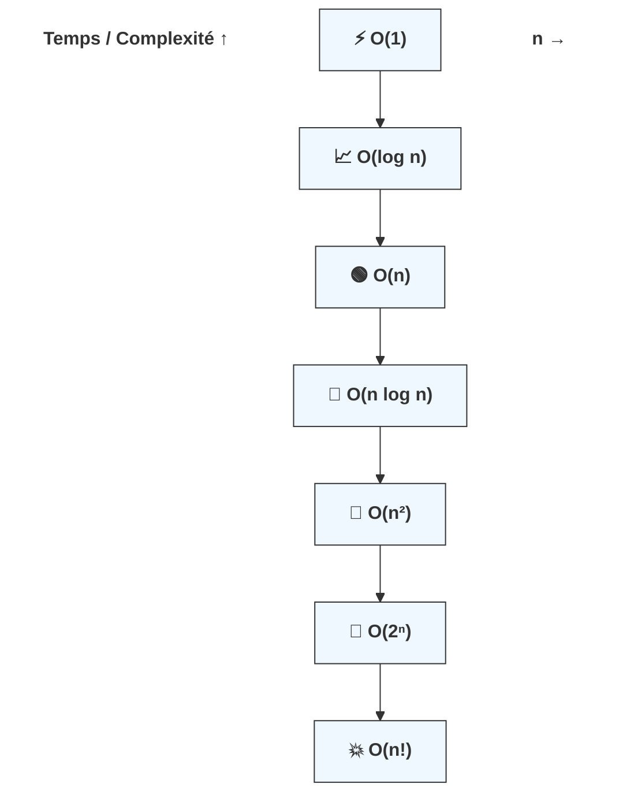

Parfait 👍
Voici la **suite de la leçon sur la notation Big-O**, avec **diagrammes simples** et **exercices progressifs**, dans l’esprit *Grokking Algorithms* (visuel, concret, intuitif).

---

## 📊 Diagramme de croissance (intuition visuelle)

Imagine l’axe horizontal comme la **taille des données (n)**
et l’axe vertical comme le **temps d’exécution**.

```
Temps ↑
      |
n!    |                         🚀
      |                     🚀
2^n   |                 🚀
      |             🚀
n²    |         📈
      |      📈
nlogn |    📊
      |  📊
n     | 📉
logn  | .
1     | .
      +--------------------------------→ n
```




👉 Plus une courbe monte vite, **moins l’algorithme est scalable**.

---

## 🧠 Règles rapides pour reconnaître la Big-O

### 1️⃣ Boucles

* **1 boucle sur n** → `O(n)`
* **2 boucles imbriquées sur n** → `O(n²)`
* **Boucle qui divise n par 2** → `O(log n)`

### 2️⃣ Séquentiel

```text
O(n) + O(n) = O(n)
O(n) + O(n²) = O(n²)
```

👉 On garde **le terme dominant**

### 3️⃣ Constantes ignorées

```text
O(5n) = O(n)
O(100) = O(1)
```

---

## ✏️ Exercices – Niveau 1 (échauffement)

### Exercice 1

```pseudo
print("Bonjour")
```

👉 Quelle est la complexité ?

<details>
<summary>Solution</summary>

**O(1)** — une seule opération, indépendante de n.

</details>

---

### Exercice 2

```pseudo
for i = 1 to n
    print(i)
```

<details>
<summary>Solution</summary>

**O(n)** — une boucle qui parcourt n éléments.

</details>

---

## ✏️ Exercices – Niveau 2 (boucles)

### Exercice 3

```pseudo
for i = 1 to n
    for j = 1 to n
        print(i, j)
```

<details>
<summary>Solution</summary>

**O(n²)** — deux boucles imbriquées.

</details>

---

### Exercice 4

```pseudo
i = n
while i > 1
    i = i / 2
```

<details>
<summary>Solution</summary>

**O(log n)** — on divise la taille du problème par 2 à chaque étape.

</details>

---

## ✏️ Exercices – Niveau 3 (combiné)

### Exercice 5

```pseudo
for i = 1 to n
    print(i)

for j = 1 to n
    print(j)
```

<details>
<summary>Solution</summary>

O(n) + O(n) = **O(n)**
👉 Les boucles sont **séquentielles**, pas imbriquées.

</details>

---

### Exercice 6

```pseudo
for i = 1 to n
    for j = 1 to 10
        print(i, j)
```

<details>
<summary>Solution</summary>

**O(n)** — la boucle intérieure est constante (10).

</details>

---

## 🧠 Exercice “Grokking style” (réflexion)

### Exercice 7 – Recherche

* Recherche linéaire dans une liste non triée
* Recherche binaire dans une liste triée

👉 Associe la bonne Big-O :

| Algorithme         | Big-O |
| ------------------ | ----- |
| Recherche linéaire | ?     |
| Recherche binaire  | ?     |

<details>
<summary>Solution</summary>

* Recherche linéaire → **O(n)**
* Recherche binaire → **O(log n)**
  (C’est exactement l’exemple central de *Grokking Algorithms*)

</details>

---

## 🎯 Exercice final (challenge)

Quelle est la Big-O de ce code ?

```pseudo
for i = 1 to n
    print(i)

for j = 1 to n
    for k = 1 to n
        print(j, k)
```

<details>
<summary>Solution</summary>

O(n) + O(n²) = **O(n²)**
👉 Le terme dominant gagne toujours.

</details>

---

## 📌 Résumé à retenir (ultra important)

* Big-O décrit la **croissance**, pas le temps exact
* On **ignore les constantes**
* On garde **le pire cas**
* Toujours chercher **le terme dominant**


