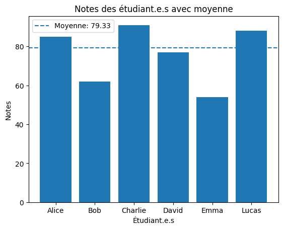
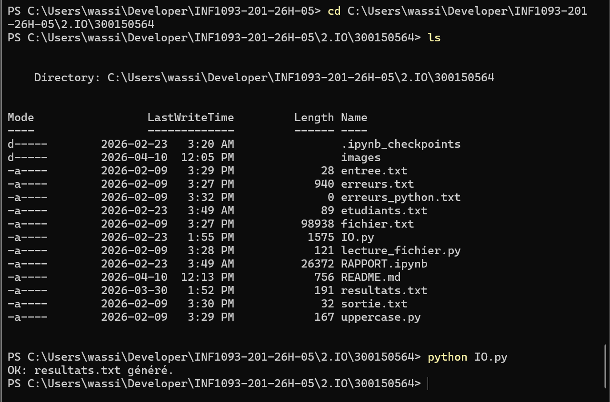

📂 TP I/O - Entrees/Sorties en Python

| Nom | Ouassim Ahmed Benamira |
|-----|------------------------|
| 🆔  | 300150564              |

---

📌 Description

Traitement des entrees/sorties avec Python et PowerShell.
Lecture de fichiers, calcul de moyenne et generation de resultats.

---

📂 Fichiers

| Fichier | Description |
|---------|-------------|
| `IO.py` | 🚀 Script principal |
| `etudiants.txt` | 📥 Fichier d'entree |
| `resultats.txt` | 📤 Fichier de sortie |
| `RAPPORT.ipynb` | 📊 Notebook avec diagramme |

---

▶️ Execution
```bash
python IO.py
```

---

📊 Resultats

- ✅ Liste des etudiants ayant >= 60
- 📈 Moyenne du groupe : 79.33

---

📊 Diagramme des notes



---

💻 Execution du script


