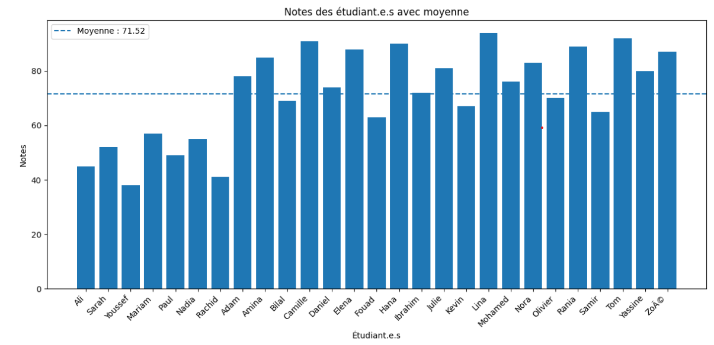

# Devoir Python – Gestion des notes

Ce projet lit un fichier contenant des étudiants et leurs notes,
calcule la moyenne du groupe et génère un fichier de résultats.

## Fichiers
- etudiants.txt : données d'entrée
- IO.py : script Python
- resultats.txt : résultats
- RAPPORT.ipynb : analyse et diagramme
## Diagramme des notes



## Exécution
```bash
python IO.py


