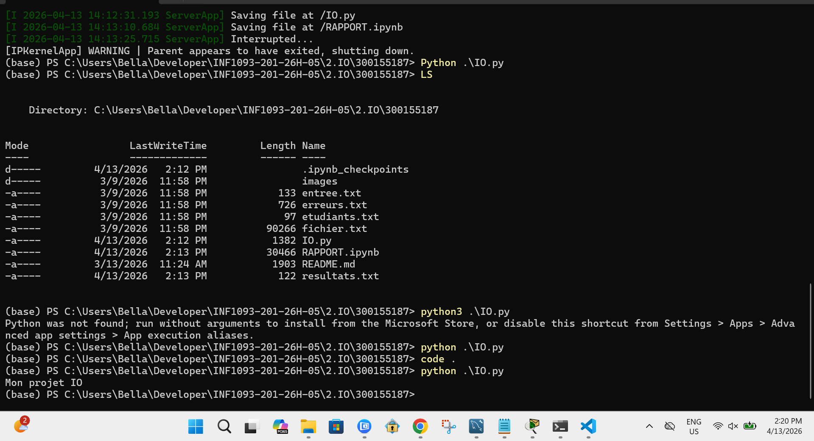

# 📂 TP I/O – Traitement des entrées/sorties

**Auteur :** Maimouna Diallo 🆔 300155187
**Date :** 02 février 2026 

---

## 1️⃣ Objectif
- Ce travail pratique porte sur la gestion des entrées et sorties (Input/Output) à l’aide de Python et PowerShell.
L’objectif est de lire un fichier contenant les noms des étudiant.e.s et leurs notes, de traiter ces données avec Python et de produire un fichier de résultats.

Le projet permet également de comprendre comment fonctionnent les flux standards et comment manipuler des fichiers texte dans un script Python. 

---

## 2️⃣  Fonctionnement

Le script IO.py effectue les étapes suivantes :

Lecture du fichier etudiants.txt

Extraction des noms et des notes

Calcul de la moyenne du groupe

Génération du fichier resultats.txt

Gestion simple des erreurs (lignes invalides)

# 📊 Diagramme des notes

Un diagramme en barres est généré dans le notebook RAPPORT.ipynb afin de visualiser les résultats.

NB :
Ce diagramme représente les notes de chaque étudiant.e. et permet de visualiser rapidement les écarts de performance au sein du groupe ainsi que la moyenne générale. 

---

### b) Lecture des données

```python
import matplotlib.pyplot as plt

noms = []
notes = []

with open("etudiants.txt", "r") as f:
    for ligne in f:
        ligne = ligne.strip()
        if not ligne:
            continue

        try:
            nom, note = ligne.split()
            noms.append(nom)
            notes.append(float(note))
        except ValueError:
            print("Ligne invalide :", ligne)
```
## 📁 Fichiers du projet

IO.py→ script principal Python

RAPPORT.ipynb → notebook avec le diagramme des notes

etudiants.txt → fichier d’entrée

resultats.txt → fichier de sortie

images/ → dossier pour les captures ou diagrammes





