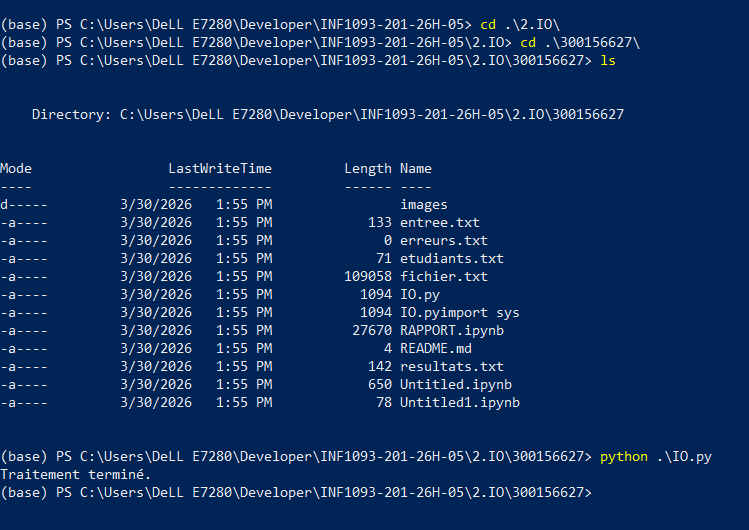
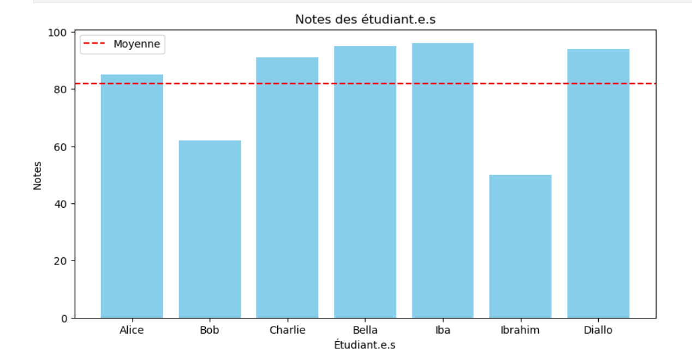

Travail pratique
Contexte
Vous créez un fichier etudiants.txt contenant une liste d’étudiant.e.s et leurs notes.

Exemple : (Utilisez votre propre contenu)

Alice 85
Bob 62
Charlie 91
Tâches à réaliser
Lire le fichier d’entrée avec Python

Calculer la moyenne

Générer un fichier resultats.txt contenant :

la liste des étudiant.e.s ayant ≥ 60
la moyenne du groupe
Rediriger les erreurs (fichier manquant, format invalide) avec PowerShell si besoin

Contraintes
Utilisation de Python pour le traitement
Utilisation de PowerShell pour les redirections et tests de flux
Script exécutable (IO.py)
🅰️ Devoir
 Script Python (IO.py) et Jupyter Notebook (RAPPORT.ipynb)

 Fichiers d’entrée etudiants.txt et de sortie resultats.txt

 Ajouter des images dans le répertoire images si nécessaire

 Court README.md expliquant le fonctionnement

 Afficher un diagramme des notes dans Jupyter Notebook

