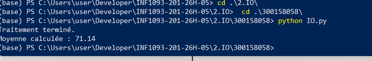

# Traitement des Entrées / Sorties – INF1093

**Nom :** BELAID Rabah  
**ID :** 300158058  

## Description
Ce travail pratique montre un exemple simple d’entrée/sortie en Python.
Le script lit un fichier `etudiants.txt`, récupère les noms et les notes,
calcule la moyenne du groupe, puis génère un fichier `resultats.txt`.

## Fichiers du projet
- `IO.py` : script principal
- `etudiants.txt` : fichier d’entrée
- `resultats.txt` : fichier de sortie
- `RAPPORT.ipynb` : petit rapport Jupyter
- `images/` : dossier pour les images

## Fonctionnement
Le programme :
1. lit les données du fichier d’entrée
2. vérifie le format des lignes
3. calcule la moyenne
4. écrit les étudiants ayant une note >= 60
5. enregistre la moyenne dans `resultats.txt`

   
## Exécution

```bash
python IO.py
```
