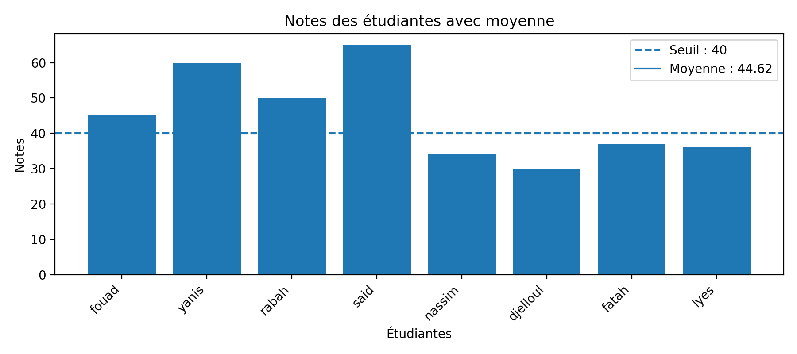
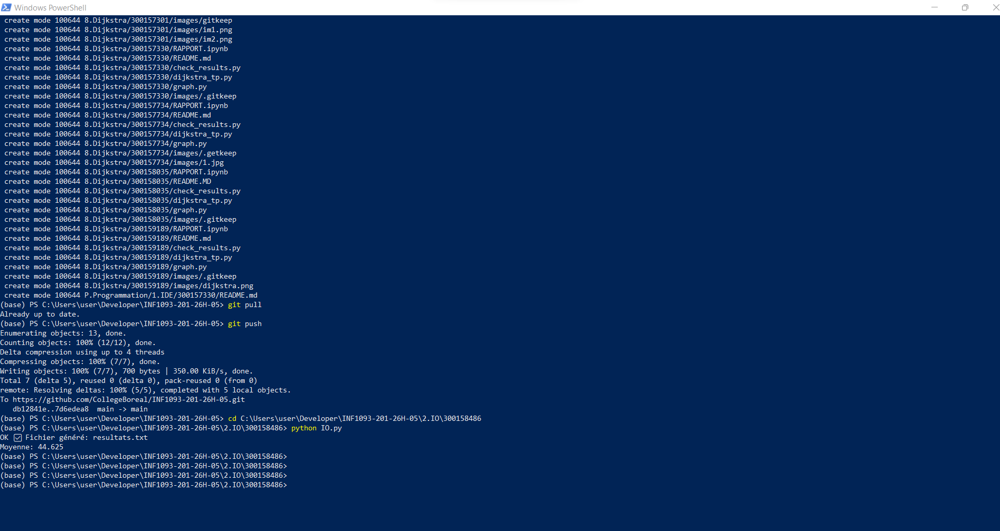

# Devoir — Traitement fichiers (Python I/O)
Auteur : Lyes Hamed
🆔 300158486
Date : 25 février 2026
## Fichiers
- `IO.py` : script Python qui lit `etudiants.txt`, calcule la moyenne et génère `resultats.txt`
- `RAPPORT.ipynb` : notebook (rapport) avec lecture, calcul, génération + diagramme des notes
- `etudiants.txt` : fichier d’entrée (nom + note)
- `resultats.txt` : fichier de sortie (liste ≥ 40 + moyenne)
- `images/` : images générées (ex: `diagramme_notes.png`)

## Format du fichier d’entrée
Une ligne par étudiant :
```
nom note
fouad 45
yanis 60
```

## Exécution (Script)
1. Ouvrir un terminal dans ce dossier.
2. Lancer :
```bash
python IO.py
```
Résultat : création / mise à jour de `resultats.txt`.

## Exécution (Notebook)
1. Ouvrir `RAPPORT.ipynb` dans Jupyter.
2. Exécuter les cellules dans l’ordre.
3. Le notebook affiche un diagramme des notes et peut sauvegarder l’image dans `images/`.
4. ## Diagramme des notes

Voici le diagramme généré dans le rapport :



## Exécution

```bash
python IO.py

## Exécution

    python IO.py

    ### Image Python
    
