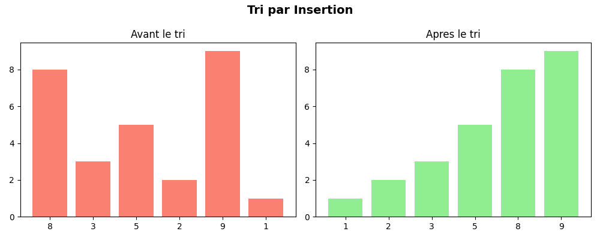
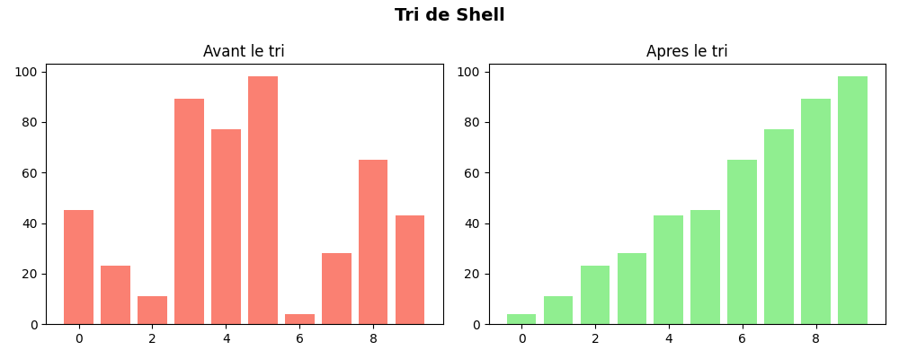
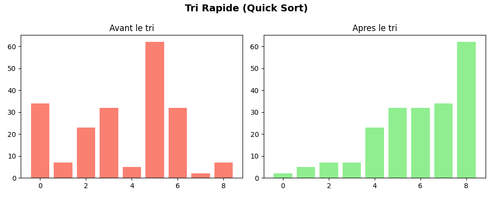

📊 TP Tris - Insertion, Shell, Quick

| Nom | Ouassim Ahmed Benamira |
|-----|------------------------|
| 🆔  | 300150564              |

---

📌 Description

Implementation de trois algorithmes de tri en Python
avec lecture depuis des fichiers d'entree.

---

📂 Structure

| Dossier | Algorithme | Complexite |
|---------|------------|------------|
| `insertion/` | 🔹 Tri par insertion | O(n²) |
| `shell/` | 🔹 Tri de Shell | O(n³/²) |
| `quick/` | 🔹 Tri rapide | O(n log n) |

---

▶️ Execution

```bash
python insertion/main.py
python shell/main.py
python quick/main.py
```

---

📊 Visualisations

🔹 Tri par Insertion



🔹 Tri de Shell



🔹 Tri Rapide

