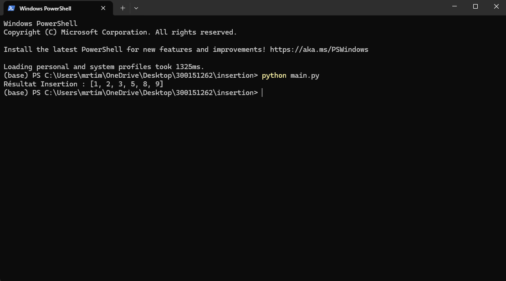
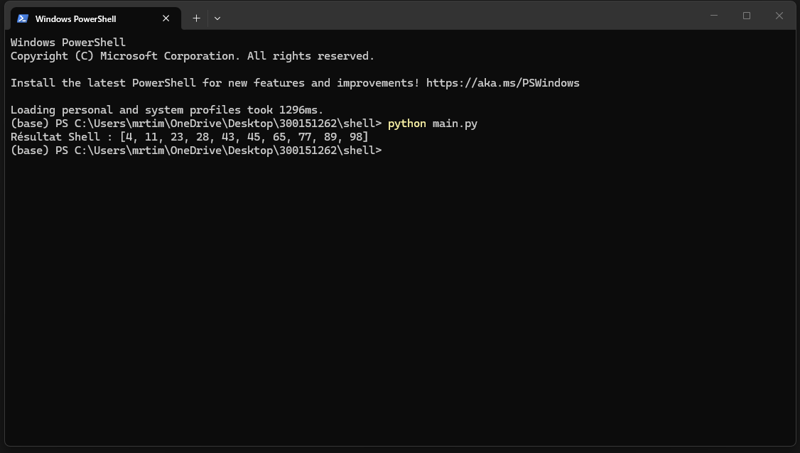
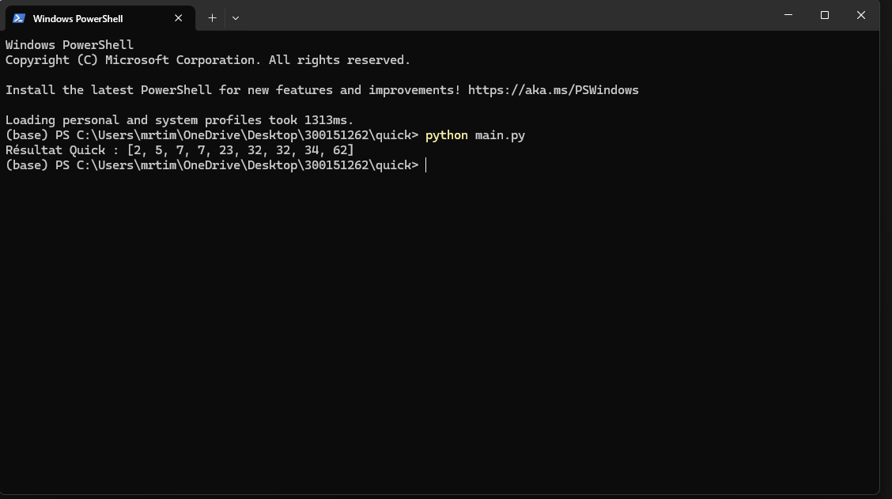

# 📘 Algorithmes de tri – Lecture depuis fichiers

## 📌 Description du projet

Ce projet implémente trois algorithmes de tri classiques en Python :

- 🔹 Tri par insertion  
- 🔹 Tri de Shell  
- 🔹 Tri rapide (Quick Sort)

Les données sont lues depuis des fichiers texte contenant des entiers séparés par des espaces.  
Cela permet de séparer les données de l’algorithme, comme dans un programme professionnel.


## 📂 Structure de répertoires

```
ID/
│
├─ insertion/
│   ├─ main.py
│   └─ entree_insertion.txt
│
├─ shell/
│   ├─ main.py
│   └─ entree_shell.txt
│
└─ quick/
    ├─ main.py
    └─ entree_quick.txt
```


## 📊 Résultats (captures d’écran)

### 🔹 1️⃣ Tri par Insertion



Résultat attendu :

[1, 2, 3, 5, 8, 9]


---

### 🔹 2️⃣ Tri de Shell



Résultat attendu :

[4, 11, 23, 28, 43, 45, 65, 77, 89, 98]


---

### 🔹 3️⃣ Tri Rapide (Quick Sort)



Résultat attendu :

[2, 5, 7, 7, 23, 32, 32, 34, 62]
