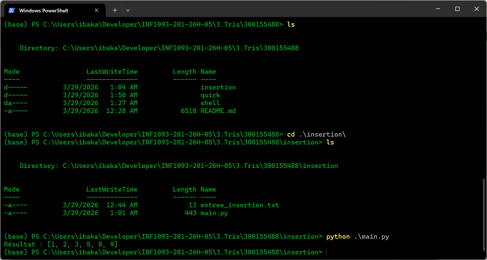

# 📘 Algorithmes de tri – Tris variés (avec fichiers d’entrée)

/*
├─ insertion/
│   ├─ main.py
│   └─ entree_insertion.txt
│
├─ shell/
│   ├─ main.py
│   └─ entree_shell.txt
│
└─ quick/ */
    ├─ main.py
    └─ entree_quick.txt
# 🔹 1. Tri par insertion

