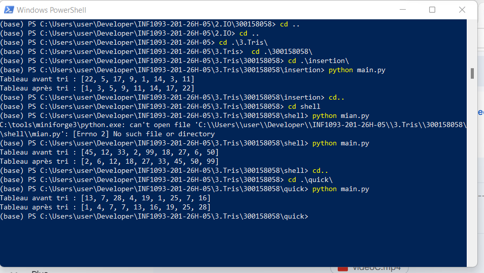

# Algorithmes de tri – Tris variés (version personnelle)

**Nom :** Rabah Belaid  
**ID :** 300158058  

## Description
Ce travail présente trois techniques de tri en Python :
- tri par insertion
- tri de Shell
- tri rapide (Quick Sort)

Chaque programme lit les données depuis un fichier texte, puis affiche le tableau avant et après le tri.

## Structure du projet
```text
300158058/
├── README.md
├── RAPPORT.ipynb
├── images/
│   └── .gitkeep
├── insertion/
│   ├── main.py
│   └── entree_insertion.txt
├── shell/
│   ├── main.py
│   └── entree_shell.txt
└── quick/
    ├── main.py
    └── entree_quick.txt
```

## Exécution
```bash
python insertion/main.py
python shell/main.py
python quick/main.py
```


