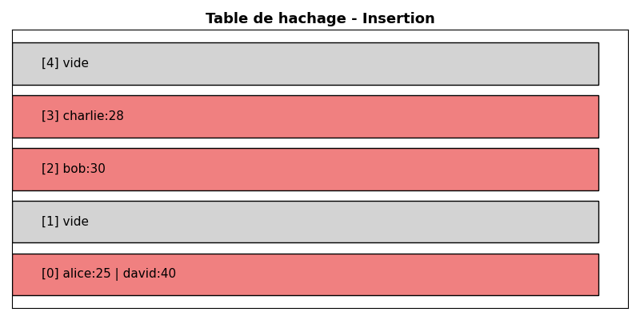
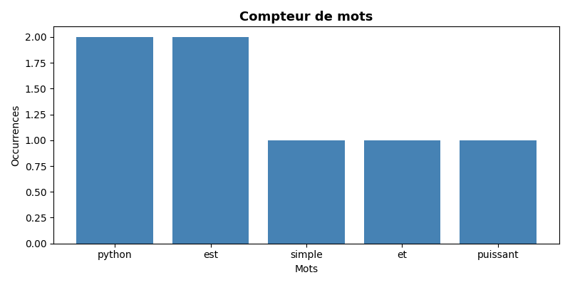
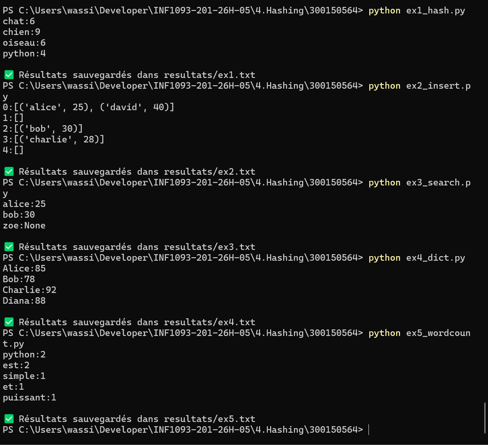

🧠 TP Hashing - Dictionnaires en Python

| Nom | Ouassim Ahmed Benamira |
|-----|------------------------|
| 🆔  | 300150564              |

---

📌 Description

Implementation du hashing et des dictionnaires en Python.
Chaque exercice ecrit ses resultats dans le dossier resultats/.

---

📂 Fichiers

| Fichier | Description |
|---------|-------------|
| `ex1_hash.py` | 🔐 Fonction de hachage simple |
| `ex2_insert.py` | ➕ Insertion dans une table |
| `ex3_search.py` | 🔍 Recherche dans une table |
| `ex4_dict.py` | 📚 Dictionnaires Python |
| `ex5_wordcount.py` | 🔢 Compteur de mots |

---

▶️ Execution

```bash
python ex1_hash.py
python ex2_insert.py
python ex3_search.py
python ex4_dict.py
python ex5_wordcount.py
```

---

📊 Visualisations

🔐 Table de hachage



🔢 Compteur de mots



---

💻 Execution des scripts

