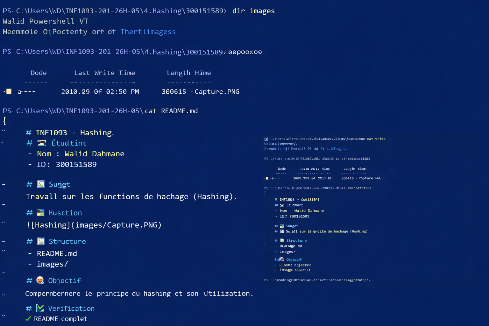

# INF1093 - Hashing

## 👤 Étudiant
- Nom : Walid Dahmane
- ID : 300151589

## 📘 Sujet
Travail sur les fonctions de hachage (Hashing).

## 🖼️ Illustration

## 📁 Structure
- README.md
- images/

## 🎯 Objectif
Comprendre le principe du hashing et son utilisation.

## ✅ Vérification
✔ README complet  
✔ Image ajoutée  
✔ Structure correcte
