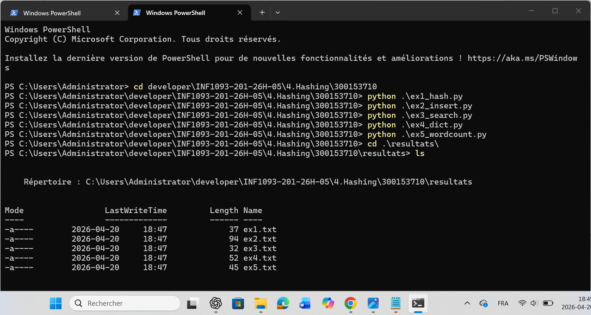

# 📘 Projet – Tables de Hachage en Python

# Étudiant : abdelfettah samy
# ID : 300153710
# Sujet : Implémentation des tables de hachage en Python

---

# 📌 Objectif du projet

Ce projet a pour objectif de comprendre le fonctionnement des **tables de hachage** et leur utilisation dans le langage Python.

À travers cinq exercices, nous explorons :

- la création d'une fonction de hachage
- l’insertion de données dans une table de hachage
- la recherche d’éléments
- l’utilisation des dictionnaires Python
- la création d’un compteur de mots

Chaque programme génère un fichier de résultats dans le dossier `resultats`.

---

# 📂 Structure du projet
Le projet doit respecter cette structure
```
300158185/
│
├── ex1_hash.py
├── ex2_insert.py
├── ex3_search.py
├── ex4_dict.py
├── ex5_wordcount.py
│
├── images/
│ └── .gitkeep
│
└── resultats/
├── ex1.txt
├── ex2.txt
├── ex3.txt
├── ex4.txt
└── ex5.txt
```

---

# Description des exercices

# Exercice 1 – Fonction de hachage
Implémentation d’une fonction de hachage simple basée sur la somme des codes ASCII des caractères d’un mot.

Formule utilisée :
hash = somme_ascii % taille_table

---

# Exercice 2 – Insertion dans une table de hachage

Création d’une table de hachage utilisant la technique du **chaînage** pour gérer les collisions.

# Les données insérées sont :
```
- Nasro → 15
- Djawed → 90
- Lahlou → 58
- Ahmed → 60
- Sara → 100
```
---

# Exercice 3 – Recherche dans la table

Implémentation d’une fonction permettant de rechercher une clé dans la table de hachage.

# Recherches effectuées :
```
- Nasro
- Djawed
- Lahlou
- Ahmed 
- Sara
```
---

# Exercice 4 – Dictionnaires Python

Utilisation du dictionnaire Python pour associer un **nom à une note**.

---

# Exercice 5 – Compteur de mots

Création d’un programme qui compte la fréquence des mots dans la phrase suivante :

python est simple et python est puissant


---



# 🎯 Conclusion

Ce projet démontre l’importance des **tables de hachage** dans la gestion efficace des données.

Les dictionnaires Python reposent eux-mêmes sur ce principe, ce qui explique leur performance dans les opérations de recherche et d’insertion.

# Les concepts étudiés sont largement utilisés dans plusieurs domaines comme :
```
- les bases de données
- les systèmes de fichiers
- les moteurs de recherche
- la cybersécurité
- la cryptographie...
```
---
