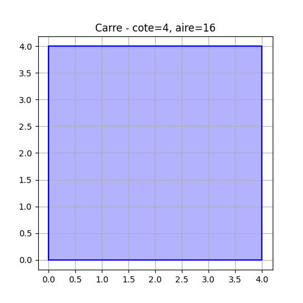
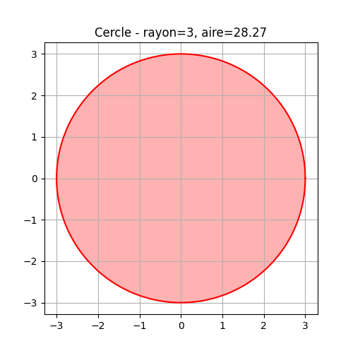
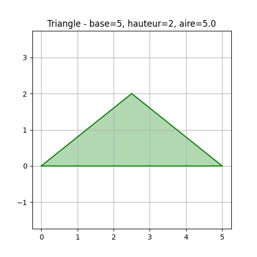

🔷 TP OOP - Figures Geometriques

| Nom | Ouassim Ahmed Benamira |
|-----|------------------------|
| 🆔  | 300150564              |

---

📌 Description

Projet Python demontrant la POO et l'heritage avec des figures geometriques.

---

📂 Fichiers

| Fichier | Description |
|---------|-------------|
| `figure.py` | 🏗️ Classe de base Figure |
| `Carre.py` | 🟦 Classe Carre |
| `Cercle.py` | ⚪ Classe Cercle |
| `Triangle.py` | 🔺 Classe Triangle |
| `main.py` | 🚀 Point d'entree |
| `RAPPORT.ipynb` | 📊 Notebook avec visualisations |

---

▶️ Execution

```bash
python main.py
```

---

📊 Visualisations

🟦 Carre



⚪ Cercle



🔺 Triangle

