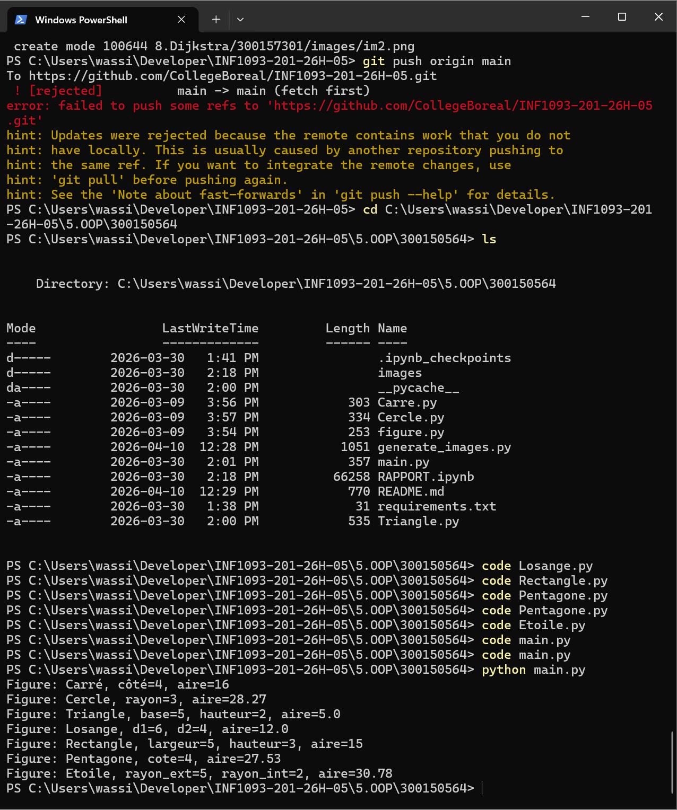
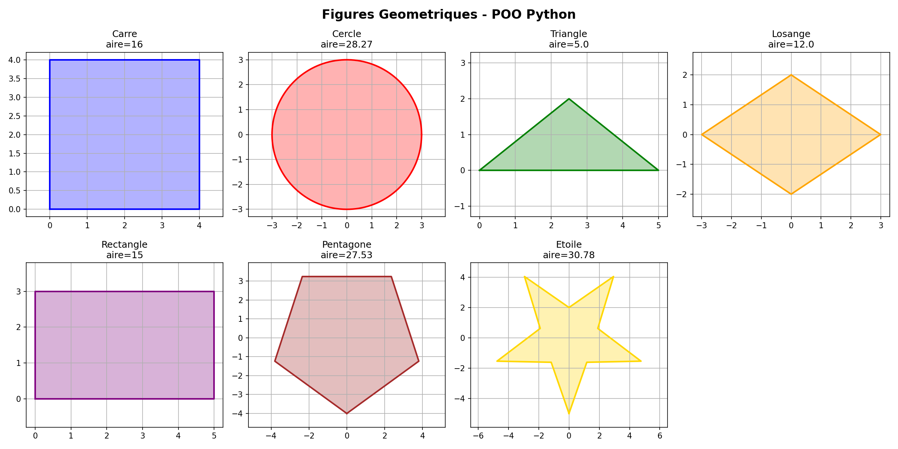

🔷 TP OOP - Figures Geometriques

| Nom | Ouassim Ahmed Benamira |
|-----|------------------------|
| 🆔  | 300150564              |
| 📚  | INF1093-201-26H-05     |

---

📌 Description

Projet Python demontrant la POO et l'heritage avec des figures geometriques 2D.
Chaque figure herite de la classe de base `Figure`.

---

🧠 Concepts POO utilises

| Concept | Description |
|---------|-------------|
| 🏗️ Heritage | Chaque figure herite de `Figure` |
| 🎭 Polymorphisme | Methode `aire()` differente par figure |
| 🔧 Encapsulation | Attributs prives par classe |
| 🧩 Abstraction | Methode `aire()` abstraite dans `Figure` |

---

📂 Fichiers

| Fichier | Figure | Aire |
|---------|--------|------|
| `figure.py` | 🏗️ Classe de base | - |
| `Carre.py` | 🟦 Carre | cote² |
| `Cercle.py` | ⚪ Cercle | π × r² |
| `Triangle.py` | 🔺 Triangle | base × hauteur / 2 |
| `Losange.py` | 🔶 Losange | d1 × d2 / 2 |
| `Rectangle.py` | ▭ Rectangle | largeur × hauteur |
| `Pentagone.py` | ⬠ Pentagone | cote² × √(25+10√5) / 4 |
| `Etoile.py` | ⭐ Etoile | 2.5 × √(5+2√5) × r² |
| `main.py` | 🚀 Point d'entree | - |
| `RAPPORT.ipynb` | 📊 Notebook | - |

---

▶️ Execution

```bash
python main.py
```

---

💻 Resultat de l'execution



---

📊 Toutes les figures geometriques



---

📦 Librairies

- 📈 matplotlib==3.9.2
- 🔢 numpy==2.1.3