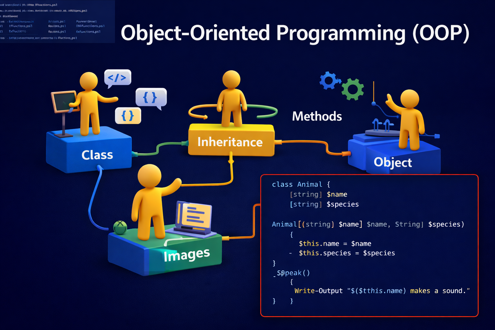

# INF1093 - OOP

## 👤 Étudiant
- Nom : Walid Dahmane
- ID : 300151589

## 📘 Sujet
Travail sur la programmation orientée objet (OOP).

## 🖼️ Illustration

## 📁 Fichiers du projet
- README.md
- images/
- functions.ps1
- DBfunctions.ps1
- Exfunctions.ps1

## 🎯 Concepts étudiés
- Classes
- Objets
- Méthodes
- Héritage
- Réutilisation du code

## ✅ Vérification
- README complet
- image présente
- structure propre
- scripts ajoutés

## 🚀 Remarque
Projet réalisé pour le devoir 3.
