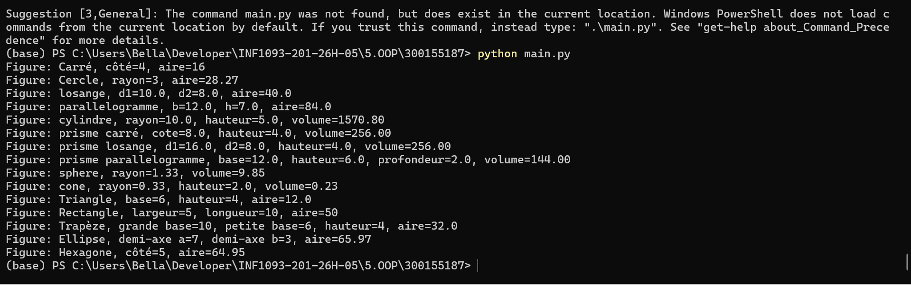

# 📘 Projet : Figures Géométriques en Python  

**👩‍🎓 Étudiante :** Maimouna Diallo  
**🆔 ID :** 300155187  

---

# ✨ Introduction  

Ce projet implémente une série de classes Python permettant de représenter et manipuler différentes figures géométriques en **2D et 3D**.

Chaque figure possède :  
- Une classe dédiée héritée de `Figure`  
- Une méthode de calcul (**aire** ou **volume**)  
- Une méthode `afficher_info()`  
- Une visualisation graphique avec **Matplotlib**

---

# 🎯 Objectifs  

- Appliquer la **programmation orientée objet (POO)**  
- Utiliser l’**héritage**  
- Visualiser des figures en **2D et 3D**  
- Automatiser les calculs géométriques  
- Comprendre la représentation cartésienne  

---

# 🧩 Structure du projet  
figure.py
carre.py
cercle.py
losange.py
parallelogramme.py
cylindre.py
prisme_carre.py
prisme_losange.py
prisme_parallelogramme.py
sphere.py
cone.py
triangle.py
rectangle.py
trapeze.py
ellipse.py
hexagone.py
main.py
rapport.ipynb

---

# 🔹 Figures disponibles  

## 🟦 Figures 2D  

| Figure | Paramètres |
|------|--------|
| Carré ⬜ | côté |
| Cercle ⚪ | rayon |
| Losange 🔶 | diagonales |
| Parallélogramme ⬛ | base, hauteur |
| Triangle 🔺 | base, hauteur |
| Rectangle ▭ | longueur, largeur |
| Trapèze | bases, hauteur |
| Ellipse | axes |
| Hexagone | côté |

---

## 🔸 Figures 3D  

| Figure | Paramètres |
|------|--------|
| Cylindre 🛢️ | rayon, hauteur |
| Prisme carré ⬛ | côté, hauteur |
| Prisme losange 🔶 | diagonales, hauteur |
| Prisme parallélogramme ▱ | base, hauteur, profondeur |
| Sphère 🌐 | rayon |
| Cône 🔺 | rayon, hauteur |

---

# 📊 Visualisation graphique  

Les figures sont tracées avec :

- `matplotlib`
- `numpy`
---



# ▶️ Exécution du projet  

## 1. Lancer le programme principal  

```bash
python main.py

# Résultat attendu (console)
Figure: Carré, côté=4, aire=16
Figure: Cercle, rayon=3, aire=28.27
Figure: losange, d1=10.0, d2=8.0, aire=40.0
Figure: parallelogramme, b=12.0, h=7.0, aire=84.0
Figure: cylindre, rayon=10.0, hauteur=5.0, volume=1570.80
Figure: prisme carré, cote=8.0, hauteur=4.0, volume=256.00
Figure: prisme losange, d1=12.0, d2=6.0, hauteur=2.0, volume=72.00
Figure: prisme parallelogramme, base=14.0, hauteur=8.0, profondeur=9.0, volume=1008.00
Figure: sphere, rayon=1.33, volume=9.85
Figure: cone, rayon=0.33, hauteur=2.0, volume=0.23
Figure: Triangle, base=6, hauteur=4, aire=12.0
Figure: Rectangle, largeur=5, longueur=10, aire=50
Figure: Trapèze, grande base=10, petite base=6, hauteur=4, aire=32.0
Figure: Ellipse, demi-axe a=7, demi-axe b=3, aire=65.97
Figure: Hexagone, côté=5, aire=64.95

# Affichage graphique
afficher_carre(c1)
afficher_cercle(c2)
afficher_losange(c3)
afficher_parallelogramme(c4)

afficher_cylindre(c5)
afficher_prisme_carre(c6)
afficher_prisme_losange(c7)
afficher_prisme_parallelogramme(c8)
afficher_sphere(c9)
afficher_cone(c10)
