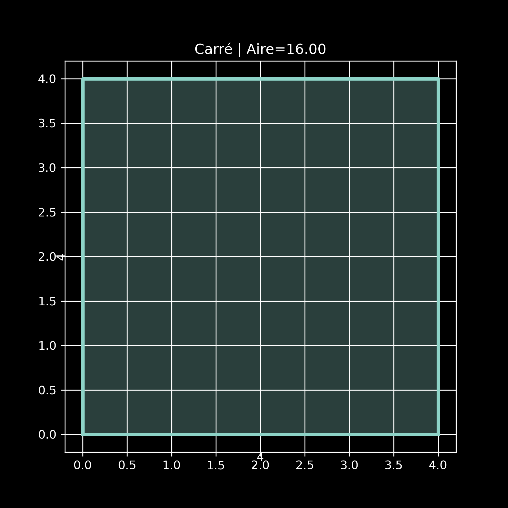
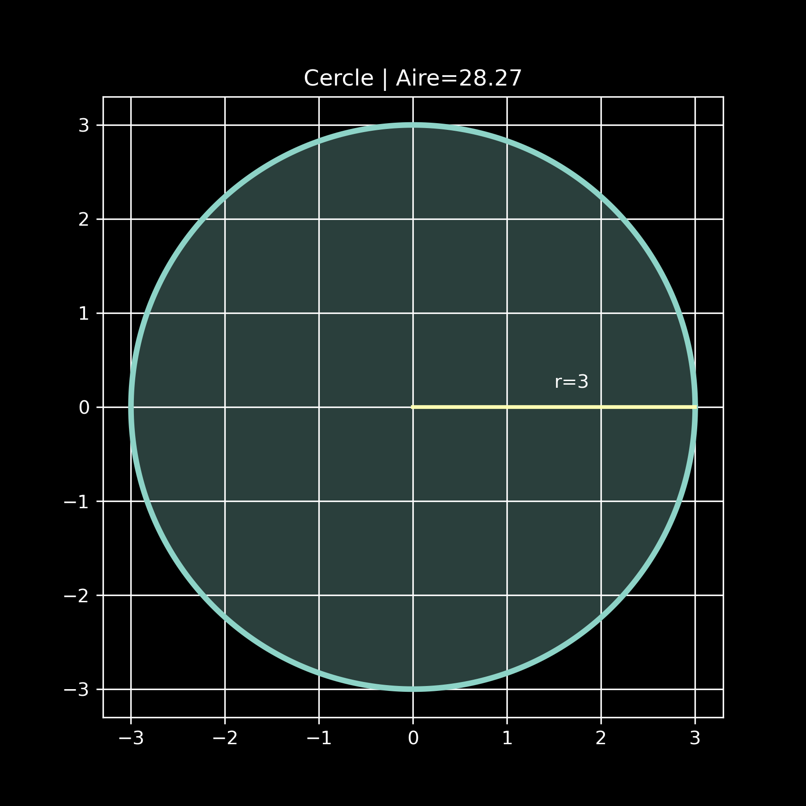
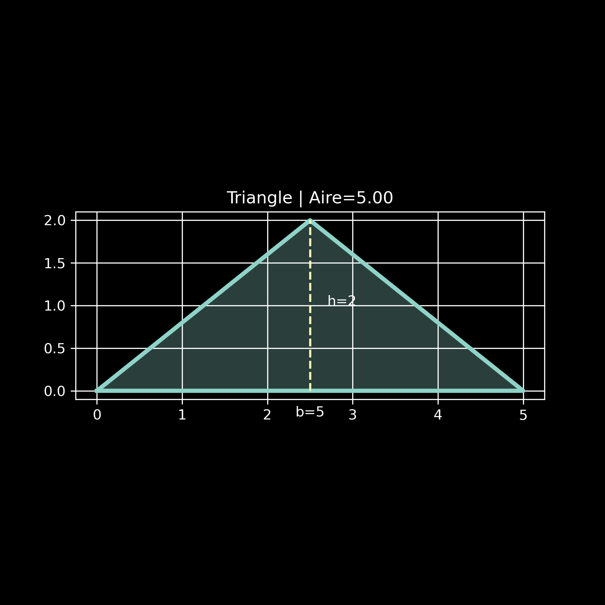
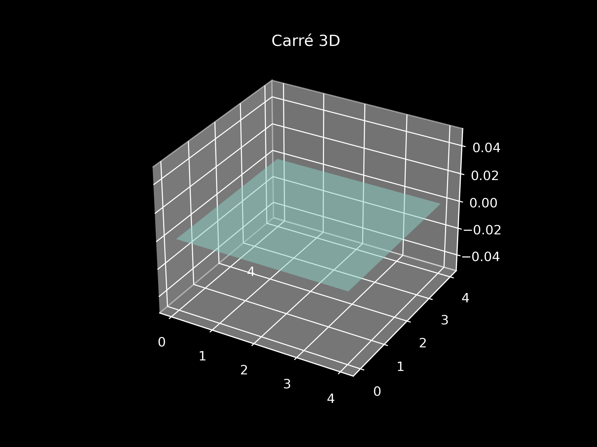
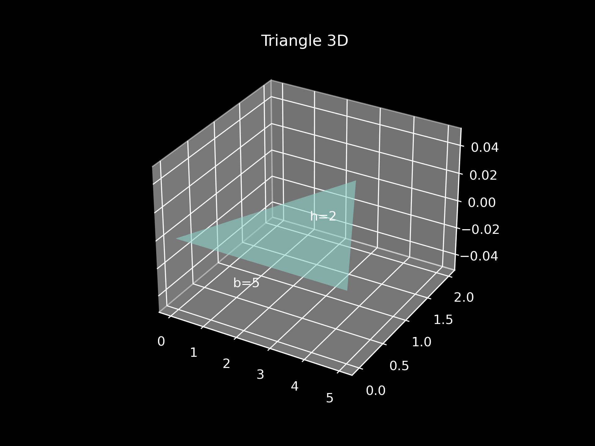

# Projet Python : Formes Géométriques
#300155488

Ce projet Python montre l’utilisation de la programmation orientée objet avec une classe de base `Figure` et trois classes dérivées : `Carre`, `Cercle` et `Triangle`.

Le programme calcule l’aire de chaque figure, affiche leurs informations et propose plusieurs visualisations :
- affichage 2D du carré ;
- affichage 2D du cercle ;
- affichage 2D du triangle ;
- affichage 3D des figures ;
- 
## Objectifs pédagogiques

Ce projet permet de comprendre :
- l’héritage en Python ;
- la redéfinition de méthodes ;
- le polymorphisme ;
- l’organisation d’un projet en plusieurs fichiers ;
- la visualisation graphique avec `matplotlib` et `numpy`.

## Structure du projet

```text
Projet/
├── README.md
├── main.py
├── figure.py
├── Carre.py
├── Cercle.py
├── Triangle.py
└── images/
```

## Description des fichiers

### `figure.py`
Contient la classe de base `Figure`.

Rôle :
- stocker le nom de la figure ;
- fournir la méthode `afficher_info()` ;
- imposer la redéfinition de `aire()` dans les sous-classes.

### `Carre.py`
Contient la classe `Carre`, qui hérite de `Figure`.

Caractéristiques :
- attribut principal : `cote` ;
- aire calculée avec `cote ** 2`.

### `Cercle.py`
Contient la classe `Cercle`, qui hérite de `Figure`.

Caractéristiques :
- attribut principal : `rayon` ;
- aire calculée avec `math.pi * rayon ** 2`.

### `Triangle.py`
Contient la classe `Triangle`, qui hérite de `Figure`.

Caractéristiques :
- attributs principaux : `base` et `hauteur` ;
- aire calculée avec `(base * hauteur) / 2`.

### `main.py`
Point d’entrée du programme.

Il permet de :
- créer les objets `Carre`, `Cercle` et `Triangle` ;
- afficher leurs informations ;
- afficher leurs représentations 2D ;
- afficher leurs versions 3D ;
- afficher une représentation 4D.

## Fonctionnement du programme

Le programme crée les figures suivantes :
- un carré de côté 4 ;
- un cercle de rayon 3 ;
- un triangle de base 5 et de hauteur 2.

Ensuite, il :
1. affiche les informations textuelles de chaque figure ;
2. calcule leurs aires ;
3. affiche chaque figure dans sa propre fenêtre ;
4. produit une visualisation 3D de chaque figure ;
5. produit une visualisation 4D basée sur la valeur de l’aire.

## Exemple de sortie texte

```python
RAPPORT : FIGURES GÉOMÉTRIQUES
------------------------------------------------------------
Informations des figures :

Figure: Carré, côté=4, aire=16
Figure: Cercle, rayon=3, aire=28.27
Figure: Triangle, base=5, hauteur=2, aire=5.0

Aires des figures :

Carré : 16.00
Cercle : 28.27
Triangle : 5.00
```

## Images du projet

### Carré en 2D


### Cercle en 2D



### Triangle  en 2D


### Carré en 3D



### Cercle en 3D


### Triangle  en 3D



## Bibliothèques utilisées

- `matplotlib` pour les graphiques 2D, 3D et la représentation 4D ;
- `numpy` pour les calculs numériques et la génération des points du cercle ;
- `math` pour la constante `pi`.

## Installation

Installe les bibliothèques nécessaires avec :

```bash
pip install matplotlib==3.9.2 numpy==2.1.3
```

Ou :

```bash
python3 -m pip install matplotlib==3.9.2 numpy==2.1.3
```

## Exécution

Pour lancer le programme :

```bash
python main.py
```

## Résultats attendus

Après l’exécution, tu dois obtenir :
- les informations des figures dans la console ;
- une fenêtre 2D pour le carré ;
- une fenêtre 2D pour le cercle ;
- une fenêtre 2D pour le triangle ;
- une fenêtre 3D propre pour chaque figure ;
- une représentation 4D plus lisible.

## Concepts de programmation utilisés

- classe et objet ;
- constructeur `__init__` ;
- héritage ;
- polymorphisme ;
- redéfinition de méthode ;
- importation de modules ;
- point d’entrée avec `if __name__ == "__main__":`.

## Conclusion

Ce projet est une bonne introduction à la programmation orientée objet en Python.

Il montre comment construire une architecture simple avec une classe de base et plusieurs classes dérivées, puis comment enrichir le projet avec des visualisations graphiques modernes en 2D, 3D et 4D.
