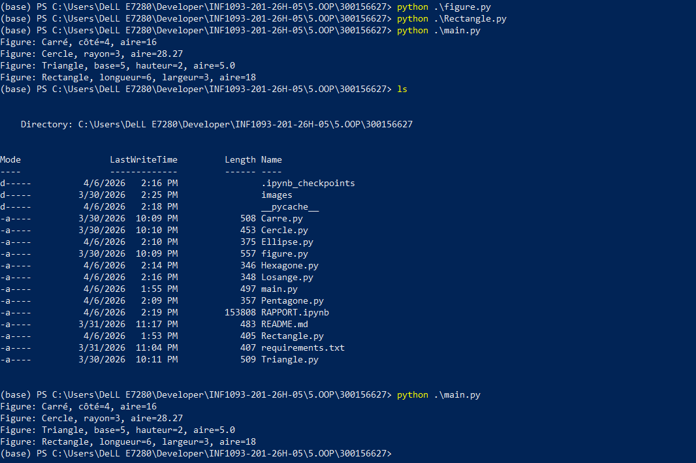
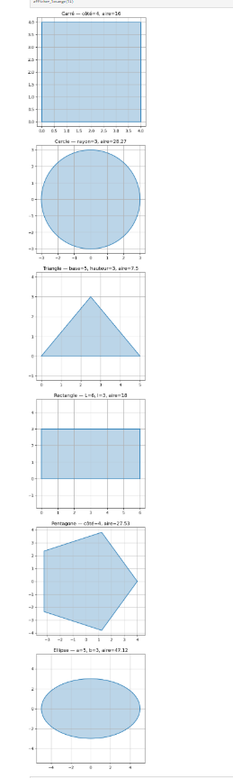

# 📘 Projet : Figures Géométriques en Python  
 # ID : 300156627
 # Etudiante : ROUGAIYATOU DIALLO
# ✨ Introduction

Ce projet présente une série de classes Python permettant de représenter et manipuler différentes figures géométriques
Chaque figure possède :  
- une classe dédiée (héritée de Figure)  
- une méthode d’affichage graphique utilisant matplotlib  
- une méthode pour calculer l’aire ou le volume  
- une méthode d’affichage d’informations

