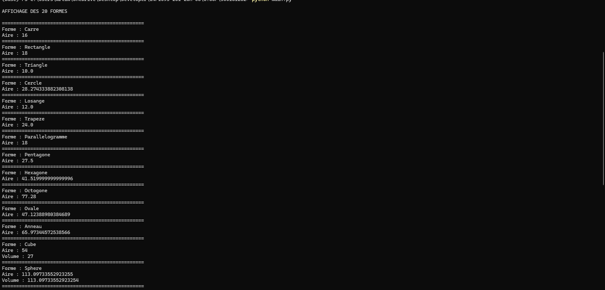

# Projet Python — Formes Géométriques

**Étudiant :** Mehani Abdenour  
**Cours :** INF1093  
**Répertoire :** `300157301

---

## 📁 Structure du projet
```
300157301/
├── README.md
├── main.py
├── figure.py
├── Carre.py
├── Rectangle.py
├── Triangle.py
├── Cercle.py
├── Losange.py
├── Trapeze.py
├── Parallelogramme.py
├── Pentagone.py
├── Hexagone.py
├── Octogone.py
├── Ovale.py
├── Anneau.py
├── Cube.py
├── Sphere.py
├── Cylindre.py
├── Cone.py
├── Pyramide.py
├── Prisme.py
├── Tore.py
├── Hemisphere.py
├── requirements.txt
└── RAPPORT.ipynb
```
---

## 📌 Description

Ce projet illustre les concepts de la programmation orientée objet (POO) en Python à travers la modélisation de 20 formes géométriques, en 2D et en 3D.

---

## 🔷 Formes utilisées

### Formes 2D
Carre, Rectangle, Triangle, Cercle, Losange, Trapeze, Parallelogramme, Pentagone, Hexagone, Octogone, Ovale, Anneau

### Formes 3D
Cube, Sphere, Cylindre, Cone, Pyramide, Prisme, Tore, Hemisphere

---

## ▶️ Exécution
```python
python main.py

```
---

## 📦 Dépendances
```python
python -m pip install -r requirements.txt
```
---

## 📓 Notebook Jupyter
```python
jupyter lab
```
Puis ouvrir RAPPORT.ipynb

---

## 📸 Capture d’écran



---

## ✅ Conclusion

Projet complet utilisant 20 formes pour illustrer la POO en Python.
