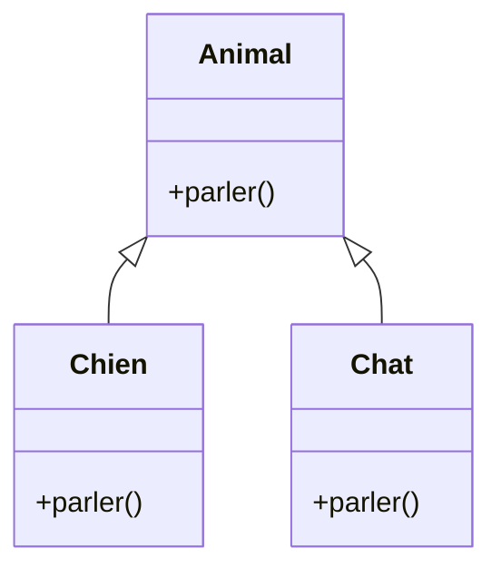
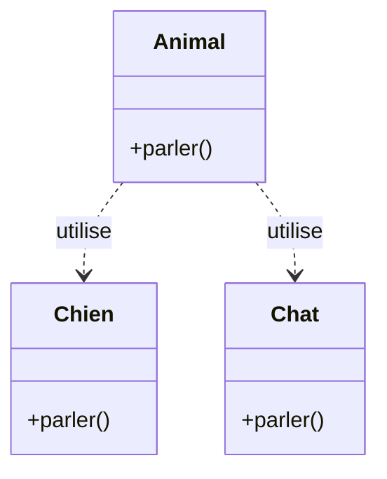

# **Programmation Orientée Objet (POO) en Python 🐍**

[:tada: Participation](.scripts/Participation.md)

---

## **1️⃣ Qu’est-ce que la POO ?**

La **programmation orientée objet (POO)** organise le code autour de **objets** plutôt que des fonctions seules.

* **🧩 Objet** : une entité combinant **données** et **comportements**
* **🏗️ Classe** : plan ou modèle pour créer un objet
* **🎯 Instance** : objet créé à partir d’une classe

**Analogie :**

* 🏠 Classe = plan de construction d’une maison
* 🏡 Objet = maison réelle construite à partir du plan

---

## **2️⃣ Pourquoi utiliser la POO ?**

* 🗂️ **Organisation** : regroupe données et fonctions liées
* 🔄 **Réutilisation** : une classe peut être réutilisée partout
* 🌱 **Héritage** : créer de nouvelles classes à partir de classes existantes
* 🎭 **Polymorphisme** : même méthode, comportements différents selon l’objet

---

## **3️⃣ Concepts clés de la POO**

### a) **Classe et objet 🏗️ → 🧩**

```python
class Personne:
    def __init__(self, nom, age):
        self.nom = nom  # attribut
        self.age = age  # attribut

    def se_presenter(self):
        print(f"Bonjour, je m'appelle {self.nom} et j'ai {self.age} ans 🖐️")

p1 = Personne("Alice", 25)
p1.se_presenter()  # Bonjour, je m'appelle Alice et j'ai 25 ans 🖐️
```

* `__init__` = **constructeur** 🛠️
* `self` = référence à **l’objet lui-même**
* Attributs = données de l’objet
* Méthodes = comportements de l’objet

---

### b) **Héritage 🌱**

```python
class Etudiant(Personne):
    def __init__(self, nom, age, niveau):
        super().__init__(nom, age)
        self.niveau = niveau

    def se_presenter(self):
        print(f"Bonjour, je suis {self.nom}, {self.age} ans, étudiant en {self.niveau} 📚")

e1 = Etudiant("Bob", 20, "Python")
e1.se_presenter()  # Bonjour, je suis Bob, 20 ans, étudiant en Python 📚
```

* `Etudiant` hérite de `Personne`
* `super().__init__()` = appel du constructeur parent
* Méthode surchargée 🎨 pour changer le comportement

---

### c) **Encapsulation 🔒**

```python
class CompteBancaire:
    def __init__(self, solde):
        self.__solde = solde  # attribut privé

    def deposer(self, montant):
        self.__solde += montant

    def retirer(self, montant):
        if montant <= self.__solde:
            self.__solde -= montant
        else:
            print("❌ Solde insuffisant")

    def afficher_solde(self):
        print(f"💰 Solde: {self.__solde}")

compte = CompteBancaire(100)
compte.deposer(50)
compte.retirer(30)
compte.afficher_solde()  # 💰 Solde: 120
```

* `_` ou `__` → attribut **privé**
* Protège les données de l’objet

---

### d) **Polymorphisme 🎭**

- [ ] Représentation Graphique de l'***Héritage***



- [ ] Représentation Graphique de la ***Dépendance***



#### 🧠 Différence importante
* Animal <|-- Chien → héritage (is-a)
* Animal ..> Chien → utilisation (uses-a)

- [ ] Implémentation en Python 🐍

```python
class Animal:
    def parler(self):
        pass

class Chien(Animal):
    def parler(self):
        print("🐶 Woof !")

class Chat(Animal):
    def parler(self):
        print("🐱 Miaou !")

animaux = [Chien(), Chat()]
for a in animaux:
    a.parler()
# Sortie:
# 🐶 Woof !
# 🐱 Miaou !
```

* Même méthode `parler()`, comportement différent selon l’objet

---

### **5️⃣ Résumé 📝**

| Concept          | Description                                        |
| ---------------- | -------------------------------------------------- |
| 🏗️ Classe       | Plan ou modèle d’un objet                          |
| 🧩 Objet         | Instance concrète d’une classe                     |
| 🔧 Attribut      | Variable appartenant à un objet                    |
| ⚙️ Méthode       | Fonction appartenant à un objet                    |
| 🌱 Héritage      | Créer une nouvelle classe à partir d’une autre     |
| 🔒 Encapsulation | Protéger les données d’un objet                    |
| 🎭 Polymorphisme | Même méthode, comportement différent selon l’objet |

---

## :b: Expérimentation

### 🎛️ Créer un fichier dans ce répertoire `(8.OOP)`:

:checkered_flag: Finalement,

- [ ] Créer un répertoire avec :id: (votre identifiant boreal)
   - [ ] `mkdir ` :id:
- [ ] dans votre répertoire ajouter le fichier `README.md`
  - [ ] `nano `README.md
- [ ] envoyer vers le serveur `github.com`
  - [ ] `cd ..`
  - [ ] `git add `:id: 
  - [ ] `git commit -m "mon fichier ..."`
  - [ ] `git push`

- [ ] Se diriger vers le répertoire avec :id: (votre identifiant boreal)
   - [ ] `cd ` :id:

- [ ] Continuer les 🔄 Exercices 

### 🔄 Exercices

#### ⚛️  **Projet Python : Formes Geométriques**

Objectif : Créer un programme Python qui définit des figures géométriques de base et des figures héritées, démontrant l’héritage et la POO (Programmation Orientée Objet).

#####  📂 **0.Structure du projet**


```
[:id:]/
│
├── README.md        # Le fichier de documentation
├── images/.gitkeep  # Le fichier permettant de garder le répertoire images
├── main.py          # Point d'entrée du programme
├── figure.py        # Classe de base Figure
├── Carre.py         # Classe Carré
└── Cercle.py        # Classe Cercle
```

---

##### **1. Fichier `figure.py`**

```python
"""
Fichier : figure.py
Description : Classe de base pour toutes les figures géométriques
Auteur : [ID de l'étudiant]
Date : YYYY-MM-DD
"""

class Figure:
    def __init__(self, nom):
        # Nom de la figure (ex: Carré, Cercle)
        self.nom = nom

    def afficher_info(self):
        # Retourne une chaîne contenant le nom de la figure
        return f"Figure: {self.nom}"

    def aire(self):
        # Méthode à implémenter par les sous-classes
        raise NotImplementedError("Cette méthode doit être implémentée par les sous-classes.")
```

---

##### **2. Fichier `Carre.py`**

```python
"""
Fichier : Carre.py
Description : Classe Carré héritant de Figure
Auteur : [ID de l'étudiant]
Date : YYYY-MM-DD
"""

from figure import Figure

class Carre(Figure):
    def __init__(self, cote):
        super().__init__("Carré")  # Appel du constructeur de la classe de base
        self.cote = cote           # Longueur du côté du carré

    def aire(self):
        # Calcul de l'aire du carré
        return self.cote ** 2

    def afficher_info(self):
        # Retourne une chaîne contenant le nom, le côté et l'aire
        return f"{super().afficher_info()}, côté={self.cote}, aire={self.aire()}"
```

---

##### **3. Fichier `Cercle.py`**

```python
"""
Fichier : Cercle.py
Description : Classe Cercle héritant de Figure
Auteur : [ID de l'étudiant]
Date : YYYY-MM-DD
"""

from figure import Figure
import math

class Cercle(Figure):
    def __init__(self, rayon):
        super().__init__("Cercle")  # Appel du constructeur de la classe de base
        self.rayon = rayon           # Rayon du cercle

    def aire(self):
        # Calcul de l'aire du cercle
        return math.pi * self.rayon ** 2

    def afficher_info(self):
        # Retourne une chaîne contenant le nom, le rayon et l'aire
        return f"{super().afficher_info()}, rayon={self.rayon}, aire={self.aire():.2f}"
```

---

##### **4. Fichier `main.py`**

```python
"""
Fichier : main.py
Description : Point d'entrée du programme. Crée un carré et un cercle et affiche leurs informations.
Auteur : [ID de l'étudiant]
Date : YYYY-MM-DD
"""

from Carre import Carre
from Cercle import Cercle

def main():
    """
    Fonction principale du programme.
    Crée un carré et un cercle, puis affiche leurs informations.
    """
    # Création d'un carré de côté 4
    c1 = Carre(4)

    # Création d'un cercle de rayon 3
    c2 = Cercle(3)

    # Affichage des informations des deux figures
    print(c1.afficher_info())
    print(c2.afficher_info())

# Point d'entrée du programme
if __name__ == "__main__":
    main()
```

---

##### **Points pédagogiques couverts**

* **Variables** : `cote`, `rayon`
* **Fonctions** : `main()`, `aire()`, `afficher_info()`
* **Modules** : import séparé depuis `Carre.py` et `Cercle.py`
* **POO et héritage** : `Figure` → `Carre` / `Cercle`
* **Point d’entrée** : `if __name__ == "__main__": main()`

✅ **Bénéfices des en-têtes :**

* Chaque fichier est **identifiable rapidement**.
* Les étudiants comprennent **la fonction et le contenu de chaque module**.
* Facilite la maintenance et le suivi dans des projets plus grands.


### **6️⃣ 🛠️ Exercice pratique : Ajouter une nouvelle figure**

**Instructions pour l'extension du projet :**

1. Crée un nouveau fichier, par exemple `Triangle.py` ou `Rectangle.py`.
2. Crée une classe qui **hérite de `Figure`**.
3. Implémente les méthodes :

   * `__init__` pour initialiser les dimensions
   * `aire()` pour calculer l’aire
4. Teste ta figure dans `main.py` :

```python
from Carre import Carre
from Cercle import Cercle
from Triangle import Triangle  # <-- votre nouvelle figure

formes = [Carre(4), Cercle(3), Triangle(5, 2)]
for f in formes:
    print(f"Aire: {f.aire()} 📏")
```

💡 **Astuce :** Tu peux ajouter une méthode `afficher_info()` pour afficher les dimensions et l’aire de ta figure.

**Objectif :** Comprendre l’héritage, le polymorphisme et comment **ajouter de nouvelles classes facilement** dans un projet POO.

---

## 🉐 Graphisme

Objectif: un notebook scientifique simple (aire, graphiques), les bibliothèques nécessaires sont :

* **matplotlib**
* **numpy**

---

### ✅ **Proposition : `requirements.txt` avec numéros de versions exacts**

Voici un fichier **fiable et compatible** :

```
matplotlib==3.9.2
numpy==2.1.3
```

Ceci permettra:

- ✅ d’utiliser tes classes `Figure`, `Carre`, `Cercle`
- ✅ d’afficher **graphiquement** les figures (carré + cercle) avec Matplotlib

=======
- ✔ Versions stables fin 2025
- ✔ Fonctionnent parfaitement ensemble
- ✔ Compatibles Python 3.10–3.12

---

### 📌 **Crée un fichier `requirements.txt` :**

- [ ] Ajoute le contenu ci-dessous au fichier

```
matplotlib==3.9.2
numpy==2.1.3
```

### 🚀 **Installation**

Dans ton :id:, lance :

```bash
pip install -r requirements.txt
```

si ça ne marche pas essaye:

```bash
python3 -m pip install -r requirements.txt
```

---

### 🔄 Exercices

#### 🧩 1️⃣ — Crée ton notebook

##### Dans Jupyter Lab

1. Ouvre ton environnement conda ou Python habituel.
2. Lance Jupyter Lab :

   ```bash
   jupyter lab
   ```
3. Clique sur ➕ `Notebook` → choisis ton environnement (ex. `INF1042-203`).
4. Sauvegarde tout de suite sous le nom :
   **`RAPPORT.ipynb`**

---

#### 🧱 2️⃣ — Structure type du rapport

Tu vas alterner **cellules Markdown** (texte explicatif) et **cellules Code** (le code à exécuter).

---

##### 🟦 **Cellule Markdown (titre principal)**

```markdown
# 🧮 Étude : Figures Géométriques — Aires et Visualisations

|     |                     |
| --- | ------------------- |
| Nom | Personne Importante |
| 🆔  | 999999999           |

Ce notebook démontre l’utilisation d’une hiérarchie de classes Python :

- `Figure` (classe de base)
- `Carre`
- `Cercle`

Puis l'affichage graphique grâce à :

- **matplotlib 3.9.2**
- **numpy 2.1.3**

Nous allons :
1. définir les classes dans le notebook  
2. créer un carré et un cercle  
3. tracer les figures graphiquement  
```

---

#### ▶️  **2. Importer les classes**

##### 🟧 **Cellule Code — Version itérative**

```python
from carre import Carre
from cercle import Cercle

c1 = Carre(4)
c2 = Cercle(3)
```

---

##### 🟧 **Cellule Code — Version itérative**


#### 🎨 **3. Imports pour l'affichage graphique**

```python
import numpy as np
import matplotlib.pyplot as plt
```

---

#### 🟦 **4. Fonction pour tracer un carré**

```python
def afficher_carre(carre):
    cote = carre.cote
    x = [0, cote, cote, 0, 0]
    y = [0, 0, cote, cote, 0]

    plt.figure(figsize=(5, 5))
    plt.plot(x, y)
    plt.fill(x, y, alpha=0.3)
    plt.title(f"Carré — côté={cote}, aire={carre.aire()}")
    plt.axis("equal")
    plt.grid(True)
    plt.show()
```

---

#### ⚪ **5. Fonction pour tracer un cercle**

```python
def afficher_cercle(cercle):
    r = cercle.rayon
    theta = np.linspace(0, 2*np.pi, 300)

    x = r * np.cos(theta)
    y = r * np.sin(theta)

    plt.figure(figsize=(5, 5))
    plt.plot(x, y)
    plt.fill(x, y, alpha=0.3)
    plt.title(f"Cercle — rayon={r}, aire={cercle.aire():.2f}")
    plt.axis("equal")
    plt.grid(True)
    plt.show()
```

---

#### 🖼️ **6. Affichage des deux figures**

```python
afficher_carre(c1)
afficher_cercle(c2)
```

---

### 🎉 Résultat

Avec ce notebook :

* tu as ta hiérarchie d’objets
* tu affiches leurs informations
* tu visualises le carré et le cercle en douceur avec matplotlib

# :books: References
