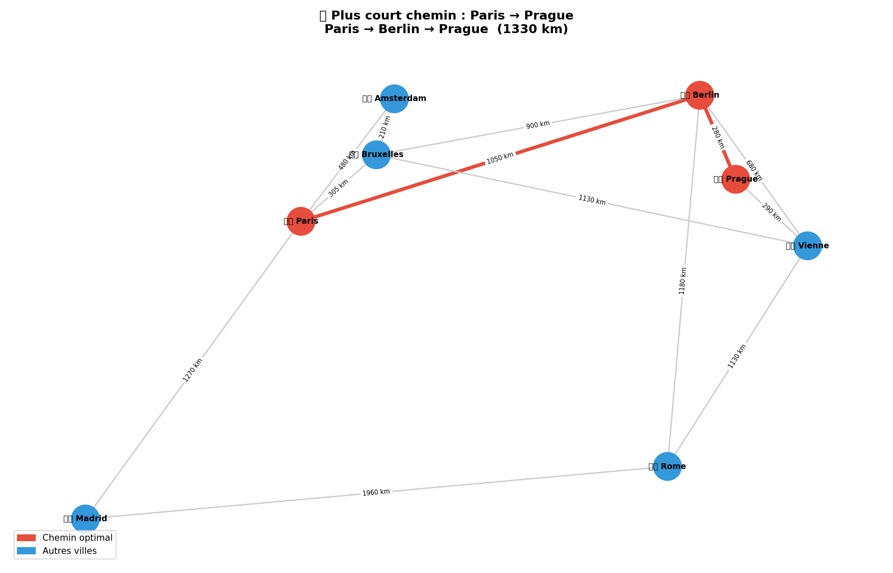
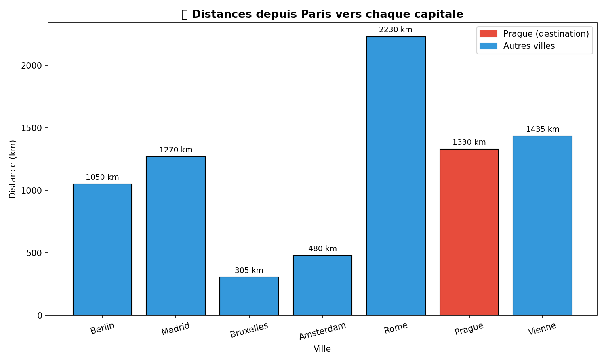
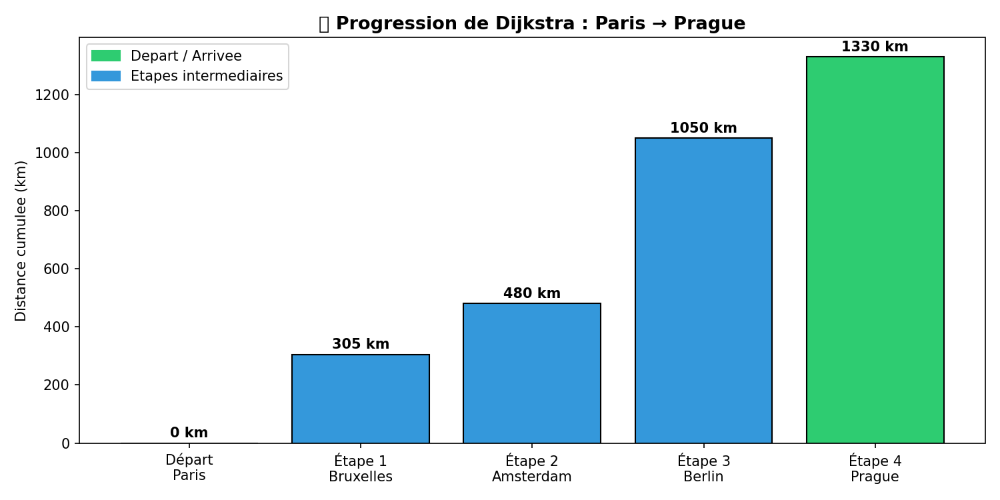

🗺️ TP Dijkstra - Capitales Europeennes

| Nom | Ouassim Ahmed Benamira |
|-----|------------------------|
| 🆔  | 300150564              |
| 📚  | INF1093-201-26H-05     |

---

📌 Description

Implementation de l'algorithme de Dijkstra pour trouver le plus court
chemin entre des capitales europeennes, en utilisant un graphe pondere.

---

🧠 Comment fonctionne Dijkstra ?

L'algorithme de Dijkstra trouve le chemin le plus court entre un point
de depart et tous les autres noeuds d'un graphe.

| Etape | Action |
|-------|--------|
| 1️⃣ | Definir la distance de depart a 0, les autres a l'infini |
| 2️⃣ | Choisir le noeud avec la plus petite distance |
| 3️⃣ | Mettre a jour les distances des voisins |
| 4️⃣ | Repeter jusqu'a atteindre la destination |

---

🗺️ Graphe des capitales

| Ville | Connexions |
|-------|------------|
| 🇫🇷 Paris | Berlin, Madrid, Bruxelles, Amsterdam |
| 🇩🇪 Berlin | Paris, Rome, Prague, Vienne, Bruxelles |
| 🇪🇸 Madrid | Paris, Rome |
| 🇮🇹 Rome | Berlin, Madrid, Vienne |
| 🇦🇹 Vienne | Berlin, Rome, Prague, Bruxelles |
| 🇳🇱 Amsterdam | Paris, Bruxelles |
| 🇧🇪 Bruxelles | Paris, Amsterdam, Berlin, Vienne |
| 🇨🇿 Prague | Berlin, Vienne |

---

📂 Fichiers

| Fichier | Description |
|---------|-------------|
| `graph.py` | 🏗️ Classes Vertex et Graph |
| `dijkstra_tp.py` | 🧮 Algorithme de Dijkstra |
| `check_results.py` | ✅ Auto-correction |
| `visualisation.py` | 🎨 Affichage graphique |
| `RAPPORT.ipynb` | 📊 Notebook avec visualisation |

---

▶️ Execution

```bash
python dijkstra_tp.py
python check_results.py
python visualisation.py
```

---

📍 Resultat optimal

| Depart | Arrivee | Chemin | Distance |
|--------|---------|--------|----------|
| 🇫🇷 Paris | 🇨🇿 Prague | Paris → Berlin → Prague | 1330 km |

---

🗺️ Visualisation du graphe



---

📈 Distances depuis Paris



---

🔄 Progression de l'algorithme



---

📦 Librairies

- 📈 matplotlib - Visualisation graphique
- 🔗 networkx - Manipulation de graphes