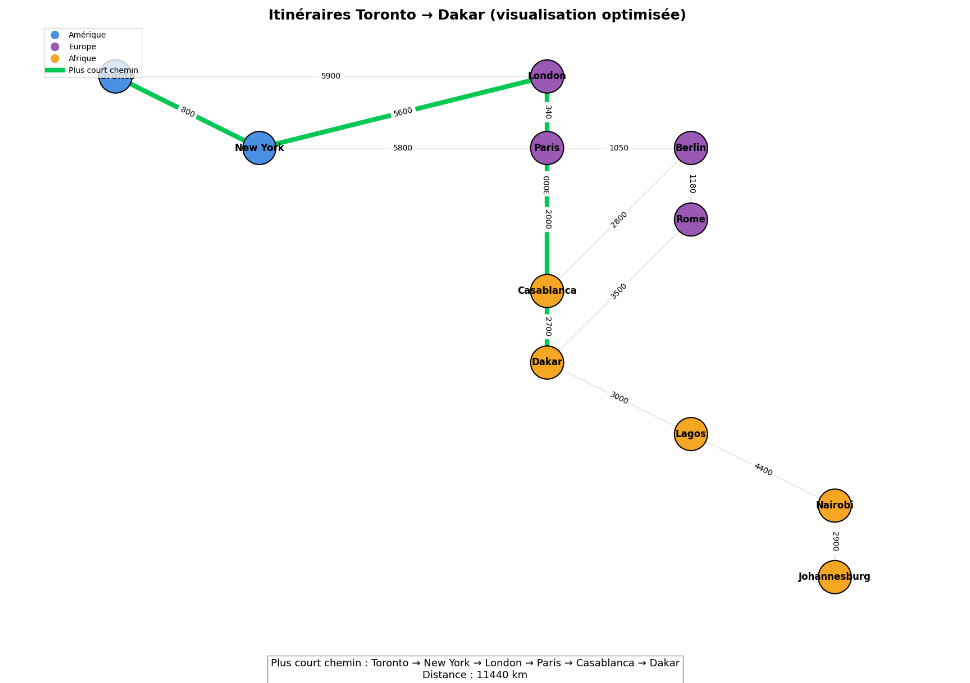

# Maimouna Diallo | 300155187
## Dijkstra – Réseau mondial

## 📌 Objectif
Ce projet a pour but d’implémenter l’algorithme de **Dijkstra** en Python afin de calculer le **plus court chemin** entre plusieurs villes dans le monde, puis de vérifier automatiquement le résultat et de visualiser le graphe.

---

## 📂 Fichiers du projet

- `graph.py`
- `dijkstra_tp.py`
- `check_results.py`
- `RAPPORT.ipynb`

---

## 1️⃣ `graph.py` – Structure du graphe

Ce fichier contient les classes nécessaires à la représentation du graphe :
- Sommets (villes)
- Arêtes (distances entre les villes)

---

## 2️⃣ `dijkstra_tp.py` – Implémentation principale

Ce fichier :
- Crée le graphe des villes
- Applique l’algorithme de **Dijkstra**
- Calcule les distances minimales
- Reconstruit le plus court chemin

---

## 3️⃣ `check_results.py` – Vérification

Ce fichier permet de :
- Tester automatiquement le résultat
- Vérifier si le chemin trouvé est correct

---

## 🧾 4️⃣ `RAPPORT.ipynb` – Visualisation

Ce notebook permet de :
- Représenter le graphe avec **NetworkX**
- Visualiser les connexions entre les villes
- Mettre en évidence le **plus court chemin**

---

## 🌍 Données utilisées

### Continents et villes :
- **Amérique du Nord** : Toronto, New York  
- **Europe** : London, Paris, Berlin, Rome  
- **Afrique** : Casablanca, Dakar, Lagos, Nairobi, Johannesburg  

---
 
 

## ▶️ Exécution du projet

Lancer les fichiers dans cet ordre :

```bash
python dijkstra_tp.py
python check_results.py

