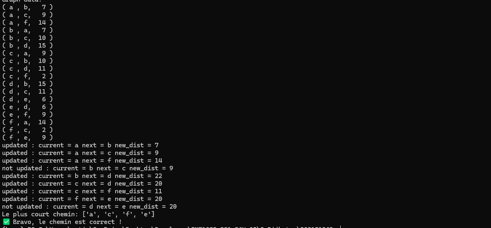

# Abdenour Mehani | 300157301
## Dijkstra 

## 📌 Objectif
Ce projet a pour but d’implémenter l’algorithme de **Dijkstra** en Python, puis de vérifier automatiquement le résultat obtenu et de visualiser le graphe utilisé.

## 📂 Fichiers à créer

On crée trois fichiers Python :

- `graph.py`
- `dijkstra_tp.py`
- `check_results.py`

Ainsi qu’un notebook :

- `RAPPORT.ipynb`

---

## 1️⃣ `graph.py` – Classes `Vertex` et `Graph`

Ce fichier contient les classes nécessaires à la représentation du graphe.

---

## 2️⃣ `dijkstra_tp.py` – TP principal

Ce fichier crée le graphe, applique l’algorithme de Dijkstra et reconstruit le plus court chemin.

---

## 3️⃣ `check_results.py` – Auto-correction

Ce fichier vérifie si le plus court chemin trouvé est correct.

---

## 🧾 4️⃣ `RAPPORT.ipynb` – Visualisation du graphe

Créer un notebook `RAPPORT.ipynb` permettant de :

- Reproduire le graphe utilisé dans `dijkstra_tp.py`
- Afficher visuellement le graphe sous forme de diagramme
- Mettre en évidence le chemin le plus court avec une couleur différente

💡 Vous pouvez utiliser les bibliothèques suivantes :

- `matplotlib`
- `networkx`

---

## ▶️ Exécution du projet

Lancer les fichiers dans cet ordre :

```bash
python dijkstra_tp.py
python check_results.py
```


## ✅ Résultat attendu

Le plus court chemin entre `a` et `e` doit être :

```python
['a', 'c', 'f', 'e']
```



## 📘 Remarque

Ce projet permet de comprendre :

- la modélisation d’un graphe en Python,
- le fonctionnement de l’algorithme de Dijkstra,
- la reconstruction du plus court chemin,
- et la visualisation graphique d’un graphe.

---
